   

 
 ### Hi, There I’m Nan (Neil) 👋
 Visitor.
 - 👀 I’m interested in AI Agent.
 - 🌱 I’m currently learning `unity` , `NPL` , `TypeScript` , and `React.js`.                 
 - 🔭 I’m currently focusing on Data processing, especially algorism.
 - 📫 reach me Neilouuo@gmail.com
 - 📖 I'm reading  ❤️
    + [Designing Data-Intensive Applications](https://www.oreilly.com/library/view/designing-data-intensive-applications/9781491903063/)
    + [Domain-Driven Design: Tackling Complexity in the Heart of Software](https://www.dddcommunity.org/book/evans_2003/)
    + [Zen and the Art of Motorcycle Maintenance: An Inquiry into Values](https://en.wikipedia.org/wiki/Zen_and_the_Art_of_Motorcycle_Maintenance)
    + [Principles](https://www.principles.com/)
    + [Of Human Bondage](https://en.wikipedia.org/wiki/Of_Human_Bondage)
    + [Walden](https://en.wikipedia.org/wiki/Walden)
    + [Silent_majority](https://en.wikipedia.org/wiki/Silent_majority)

 |  |  |
| --- | --- |

 

 🎃 My Projects

 
 
 
 
 
 ⚡ Projects I've contributed to 
 
  
  
 

  
  
  
  
  
  
  
  
  

<!---
Neilouo/Neilouo is a ✨ special ✨ repository because its `README.md` (this file) appears on your GitHub profile.
You can click the Preview link to take a look at your changes.
--->

